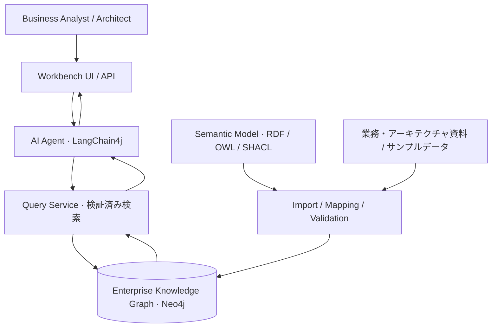
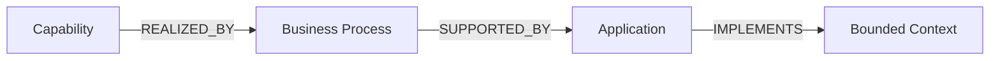

# arch-knowledge

**Business Architecture から Software Architecture までをつなぐ、Enterprise Knowledge Graph + AI Agent Workbench。**

`arch-knowledge` は、企業の業務とソフトウェアの関係を Knowledge Graph として表現し、人間と AI が共通の企業モデルを使って分析・設計・意思決定するための、JVM ベースの実験的なプロジェクトです。

Business Analyst、Architect、AI Agent が同じ知識基盤を参照し、「ある Capability を変更すると何に影響するか」を、自然言語と根拠となるグラフの両方から確認できる環境を目指します。

> **Status: Early Prototype**  
> 現在実装されているのは、インメモリの企業モデルに対する決定的な影響分析と、それを実行する CLI だけです（[現在の実装](#現在の実装)を参照）。Neo4j、LLM、Quarkus、UI、RDF / OWL / SHACL は未実装で、以下のうちそれらに関する記述は構想です。ライセンスは未定です。

## 現在の実装

### 目的

「この Capability を変更すると、何に影響する可能性があるか」という問いに、登録済みの関係だけを根拠として答えます。Core は Capability などのドメイン概念を持たない汎用のグラフと影響分析で構成し、ドメイン概念は Profile で定義します。LLM やデータベースを使わずに、決定的に動作します。

### 構成

| モジュール | 役割 |
| --- | --- |
| `core/` | 汎用モデル（Concept / Relation / Schema）、`ConceptGraph` ポートとインメモリ実装、影響分析 `ImpactAnalyzer`。依存は kotlin-stdlib のみ |
| `application/` | ユースケース `AnalyzeImpact`（既定の探索設定の適用、要求の検証） |
| `profiles/business-software/` | Capability / BusinessProcess / Application / BoundedContext と、REALIZED_BY / SUPPORTED_BY / IMPLEMENTS の定義、既定の探索設定 |
| `examples/order-management/` | 架空の Order Management データと期待結果（[README](examples/order-management/README.md)） |
| `applications/cli/` | CLI（各モジュールの組み立てと結果の表示） |
| `docs/adr/` | 設計判断（0001〜0003 は Accepted） |

依存は内向きのみです（application / profiles → core、examples → core・profiles、cli → すべて）。設計判断は次の ADR にまとめています。

- [0001 メタモデル非依存の Core と初期モジュール構成](docs/adr/0001-metamodel-agnostic-core-and-module-layout.md)
- [0002 影響分析のトラバーサルと根拠経路の意味論](docs/adr/0002-impact-traversal-and-evidence-semantics.md)
- [0003 Kotlin/JVM ツールチェーンとビルド構成](docs/adr/0003-kotlin-jvm-toolchain.md)

### 影響分析の意味論（要約）

- 関係は `source -> target` の向きで保存します。Profile の既定の探索は、3 つの関係型を保存方向（`OUTGOING`）に最大深さ 3 まで辿ります。
- 開始 Concept は影響先に含めず、別に表示します。
- 長さが最大深さ以下の単純経路（同じ Concept を再訪しない経路）をすべて根拠として返します。経路は relation ID の並びで重複を除きます。
- 循環は経路の終端として扱い、「不完全」にはしません。深さ制限によって延長できる経路を打ち切った場合に限り、結果を **INCOMPLETE** と表示します。
- 並び順は（距離、型、ID）、経路の順は（長さ、relation ID の並び）で、入力の順序には依存しません。
- 開始 ID が存在しない場合は、明示的なエラーとして返します。到達先がない場合も「影響なし」とは断定しません。

詳細は [ADR 0002](docs/adr/0002-impact-traversal-and-evidence-semantics.md) を参照してください。

### 必要な環境

- JDK 25（`JAVA_HOME` を JDK 25 に設定するか、`PATH` 上の `java` を JDK 25 にする）。Amazon Corretto 25.0.3 で確認しています。
- Gradle は同梱の Wrapper（9.6.1）を使います。別途インストールする必要はありません。

### 実行方法

```bash
./gradlew :applications:cli:run --args="concepts"
./gradlew :applications:cli:run --args="impact cap-order-management"
./gradlew :applications:cli:run --args="impact cap-order-management --depth 2"
```

Windows では `.\gradlew.bat` を使います。`./gradlew :applications:cli:installDist` を実行すると、`applications/cli/build/install/arch-knowledge/bin/arch-knowledge` から直接実行できます。

終了コードは、成功が `0`、Concept が存在しない場合や要求が不正な場合が `1`、引数の誤りが `2` です。

### テスト方法

```bash
./gradlew test           # 全モジュールのテスト
./gradlew build          # コンパイル + テスト（check を含む）
./gradlew :core:test     # モジュール単位（:application, :profiles:business-software, :examples:order-management, :applications:cli）
```

フォーマッタや静的解析は、まだ設定していません。

## Vision

業務能力、業務プロセス、アプリケーション、ソフトウェアの設計境界は、別々の資料やツールで管理されがちです。`arch-knowledge` はこれらの関係を明示し、変更の影響を境界を越えてたどれるようにします。

- **Business Analyst** は、業務変更とそれを支えるシステムの関係を理解する。
- **Architect** は、業務上の意図とソフトウェア構造の整合性を検討する。
- **AI Agent** は、共有モデルを検索し、根拠を示して分析を支援する。

Knowledge Graph を共通の知識基盤とし、LLM は自然言語との橋渡しと説明を担います。意思決定の主体は人間です。

## Goals / Non-goals

### Goals

- Business Architecture と Software Architecture の要素・関係を、一貫した企業モデルとして扱う。
- 自然言語の問いを、検証可能なグラフ検索と根拠付きの回答につなげる。
- 変更の影響候補を、関係の経路とともに提示する。
- RDF / OWL / SHACL によって、語彙・意味・制約を明示する。
- 小さな Vertical Slice を動かし、実例を通じてモデルと実装を改善する。

### Non-goals（初期段階）

- 企業全体を網羅する完全な Ontology や、汎用 EA ツールの完成。
- 既存の EA、BPM、CMDB、ソースコード管理ツールの全面的な置き換え。
- AI による無承認のモデル更新、設計決定、システム変更。
- グラフの接続関係だけから、実際の影響や因果関係を断定すること。
- 本番運用に必要な高可用性、マルチテナント、詳細な権限管理の初期実装。

## Architecture Concept



Quarkus をアプリケーション基盤とし、検索・モデル管理・AI 連携をモジュールとして分離する構想です。MVP では単一アプリケーションから始め、マイクロサービス化を前提にしません。

Neo4j は関係の保存・探索を担い、RDF / OWL は語彙と意味の定義、SHACL は取り込み時の構造検証に使う想定です。Neo4j の Property Graph と RDF の対応付けは明示的に設計します。Neo4j が OWL 推論や SHACL 検証を標準で実行することは前提にせず、変換・検証方式は別途選定します。

LLM にデータベースへの任意操作を委ねず、アプリケーション側が許可する読み取り専用の検索機能を Agent に提供します。

## Initial Domain Model

最初の対象は、次の Vertical Slice です。

**Capability → Business Process → Application → Bounded Context**

| 要素 | 意味 | 例 |
| --- | --- | --- |
| Capability | 企業が備える業務能力。「何ができるか」 | 受注管理 |
| Business Process | 能力を実現する業務の流れ | 注文受付 |
| Application | 業務を支援するアプリケーション | Order Management System |
| Bounded Context | ドメインモデル・用語の意味が一貫する設計境界 | Order Context |

### 関係の初期案



| 関係 | 読み方 |
| --- | --- |
| `Capability -[:REALIZED_BY]-> BusinessProcess` | Capability は Business Process によって実現される |
| `BusinessProcess -[:SUPPORTED_BY]-> Application` | Business Process は Application によって支援される |
| `Application -[:IMPLEMENTS]-> BoundedContext` | Application は Bounded Context の実装を担う |

関係名と方向は、この初期案のまま business-software Profile に実装しています（保存方向は矢印の向きです。[ADR 0002](docs/adr/0002-impact-traversal-and-evidence-semantics.md) を参照。Accepted）。各関係は複数対複数を許容し、Application と Bounded Context を一対一とみなしません。Bounded Context はデプロイ単位と同義ではありません。

各要素には、表示名から独立した安定 ID、名前、説明、出典を持たせる想定です。関係にも出典と更新情報を保持し、未登録の関係と「関係がない」状態を区別する方針です。

## First Use Case: Capability Change Impact Analysis

> 「受注管理 Capability を変更すると、どの業務プロセス、アプリケーション、Bounded Context に影響する可能性がありますか？」

### 想定フロー

1. 自然言語から対象 Capability を特定する。同名候補がある場合は選択を求める。
2. 許可された検索機能で、対象から Vertical Slice の関係をたどる。
3. 到達した要素、経路、出典を取得する。
4. AI が影響候補を要約し、グラフから確認できる事実と推測を区別する。
5. ユーザーが根拠を確認し、追加調査や設計判断につなげる。

### 回答イメージ（架空のサンプル）

```text
対象 Capability: 受注管理

影響候補:
  Business Process: 注文受付
  Application: Order Management System
  Bounded Context: Order Context

根拠経路:
  受注管理 --REALIZED_BY--> 注文受付
           --SUPPORTED_BY--> Order Management System
           --IMPLEMENTS--> Order Context

出典: サンプル企業モデル v0.1

解釈:
  登録された関係から、上記要素を変更時の確認対象として抽出しました。
  実際の改修要否は、変更内容と各要素の責務を確認する必要があります。
```

MVP の「影響分析」は、登録された関係に基づく影響候補の抽出です。変更内容の意味解析、影響度の定量評価、改修工数の見積もりは対象外です。到達先がない場合も「影響なし」と断定せず、未登録・情報不足の可能性を示します。

## Technology Stack

以下は採用予定の Core Stack です。ライブラリのバージョンと組み合わせは、動作検証後に固定します。

| 技術 | 想定する役割 |
| --- | --- |
| Java 25 | JVM 実行基盤（ツールチェーン） |
| Kotlin | 主要な実装言語（Core、Profile、Application、CLI） |
| Scala 3 | 型を活用したモデリング・変換処理の選択肢 |
| Quarkus | API とアプリケーションの実行基盤 |
| Neo4j | Property Graph の保存と関係探索 |
| LangChain4j | LLM 連携と Agent の検索ツール呼び出し |
| RDF / OWL | 語彙と意味モデルの定義 |
| SHACL | グラフデータの制約・品質検証 |

3 言語の併用自体を目的にせず、最小構成で始めます。現在の実装は Kotlin 2.3.21 / Java 25 ツールチェーン / Gradle 9.6.1（Kotlin DSL）です（[ADR 0003](docs/adr/0003-kotlin-jvm-toolchain.md)、Accepted）。Quarkus、Neo4j、LangChain4j、RDF / OWL / SHACL はまだ導入していません。Scala 3 は必要性が明確になってから検討します。LLM Provider、UI 技術、RDF 処理ライブラリは未定です。

## Repository Structure

現在のモジュールは[現在の実装](#現在の実装)に記載しています。今後の目標構成は [AGENTS.md](AGENTS.md) の "Intended layout" に従います（`adapters/neo4j/`、`adapters/llm-langchain4j/`、`applications/server/`、`deployment/` など）。これらは必要になった時点で追加し、空のモジュールを先に作ることはしません。

## Getting Started

インメモリの影響分析は、[実行方法](#実行方法)の手順でそのまま試せます。Neo4j、LLM Provider、認証情報の設定手順は、それらの統合を実装した時点で追加します。認証情報はリポジトリに含めず、サンプルには架空のデータを使います。

## Roadmap / MVP

### 1. モデルの定義

- [x] 4 要素と 3 関係の語彙・意味を定義する（business-software Profile。ADR 0002 は Accepted）。
- [ ] 安定 ID、出典、更新情報の扱いを決める（安定 ID と出典の文字列は実装済み。更新情報は未定）。
- [ ] RDF / OWL と Property Graph のマッピングを定義する。
- [ ] 最小限の SHACL 制約と架空企業データを用意する（架空データと、Core による型・端点の検証は実装済み。SHACL は未実装）。

### 2. グラフの取り込み・検索

- [ ] 検証付きのサンプルデータ取り込みを実装する（インメモリのデータを Profile で検証する部分は実装済み。ファイルや Neo4j からの取り込みは未実装）。
- [x] Capability を起点とする読み取り専用検索を実装する（インメモリ。Neo4j は未実装）。
- [ ] 到達要素と根拠経路を返す API を用意する（ユースケースと CLI は実装済み。サーバー API は未実装）。

### 3. 自然言語による問い合わせ

- [ ] LangChain4j から検索機能を呼び出す。
- [ ] Capability の曖昧性解消と未登録時の応答を実装する。
- [ ] 出典・経路付きで影響候補を説明する。
- [ ] 質問と期待結果のセットで回答を評価する。

### MVP の完了条件

- サンプル環境を手順に沿って再現できる。
- 自然言語の質問から、対象 Capability に関連する 3 種類の要素を取得できる。
- 回答の要素と経路が登録済みデータに一致し、根拠を確認できる。
- 未登録、同名候補、関係の欠落を扱い、存在しない要素・関係を回答に追加しない。
- 問い合わせ処理によってグラフが更新されない。

### MVP 以降の候補

モデルの可視化、変更前後の比較、外部資料との連携、レビュー付きモデル更新を検討します。権限管理や監査などの運用要件は、利用範囲を広げる前に具体化します。これらの実装時期は未定です。

## Design Principles

1. **Graph-grounded answers** — 回答を登録された要素・関係・出典に結び付ける。
2. **Explicit semantics** — 要素と関係の意味を定義し、名前だけで意味を推定しない。
3. **Human-in-the-loop** — AI は分析を支援し、判断と変更承認は人間が担う。
4. **Small vertical slices** — 全体を先に作り込まず、問いから根拠付き回答までを通して検証する。
5. **Separation of concerns** — モデル、永続化、検索、AI 連携の責務を分ける。
6. **Traceability and uncertainty** — 出典をたどれるようにし、事実・推測・情報不足を区別する。
7. **Reproducibility** — サンプルデータと期待結果を共有し、LLM を介さない検索の正しさも検証する。

## Contributing

コントリビューション手順は準備中です。初期段階では、ユースケース、ドメイン用語、関係の意味、サンプルデータ、設計へのフィードバックを歓迎します。

大きな実装変更は、まず Issue で目的と対象範囲を共有してください。企業の機密情報や個人情報を含むデータは投稿せず、架空または公開可能な例を使用してください。

`CONTRIBUTING.md`、開発環境、コード規約、テスト手順は今後追加予定です。

## License

**TBD — ライセンスは未選定です。**

オープンソースとしての公開を目指していますが、利用・改変・再配布の条件は、今後追加する `LICENSE` ファイルで明示します。公開リポジトリであること自体は、これらの許諾を意味しません。
