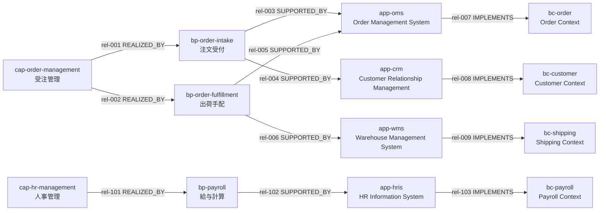

# Order Management example

架空の企業モデルです。business-software Profile に適合しており（テストで検証しています）、定義は [OrderManagementExample.kt](src/main/kotlin/io/github/yamakenji/archknowledge/examples/ordermanagement/OrderManagementExample.kt) にあります。

## データ

- 分岐: Capability から 2 つの BusinessProcess、各 BusinessProcess から 2 つの Application に分かれる。
- 合流: `app-oms` は 2 つの BusinessProcess から支援関係を持つ。そのため `app-oms` と `bc-order` には根拠経路が 2 本ずつある。
- 無関係なノード: 人事管理の系列は Order Management と接続していない。

## 期待される結果

`cap-order-management` を起点に、Profile の既定の探索（`downstreamImpact`: 3 関係型、`OUTGOING`、`maxDepth = 3`）を行った場合:

| # | Concept | 型 | distance | 根拠経路（relation ID） |
| --- | --- | --- | --- | --- |
| 1 | bp-order-fulfillment | BusinessProcess | 1 | rel-002 |
| 2 | bp-order-intake | BusinessProcess | 1 | rel-001 |
| 3 | app-crm | Application | 2 | rel-001, rel-004 |
| 4 | app-oms | Application | 2 | rel-001, rel-003 / rel-002, rel-005 |
| 5 | app-wms | Application | 2 | rel-002, rel-006 |
| 6 | bc-customer | BoundedContext | 3 | rel-001, rel-004, rel-008 |
| 7 | bc-order | BoundedContext | 3 | rel-001, rel-003, rel-007 / rel-002, rel-005, rel-007 |
| 8 | bc-shipping | BoundedContext | 3 | rel-002, rel-006, rel-009 |

- 結果は完全（`truncated = false`）。
- 人事管理系列の 4 Concept は含まれない。
- `maxDepth = 2` の場合は BoundedContext を除く 5 件になり、`truncated = true`（不完全）となる。

これらの期待値は `OrderManagementExampleTest` と `CliTest` で固定しています。
